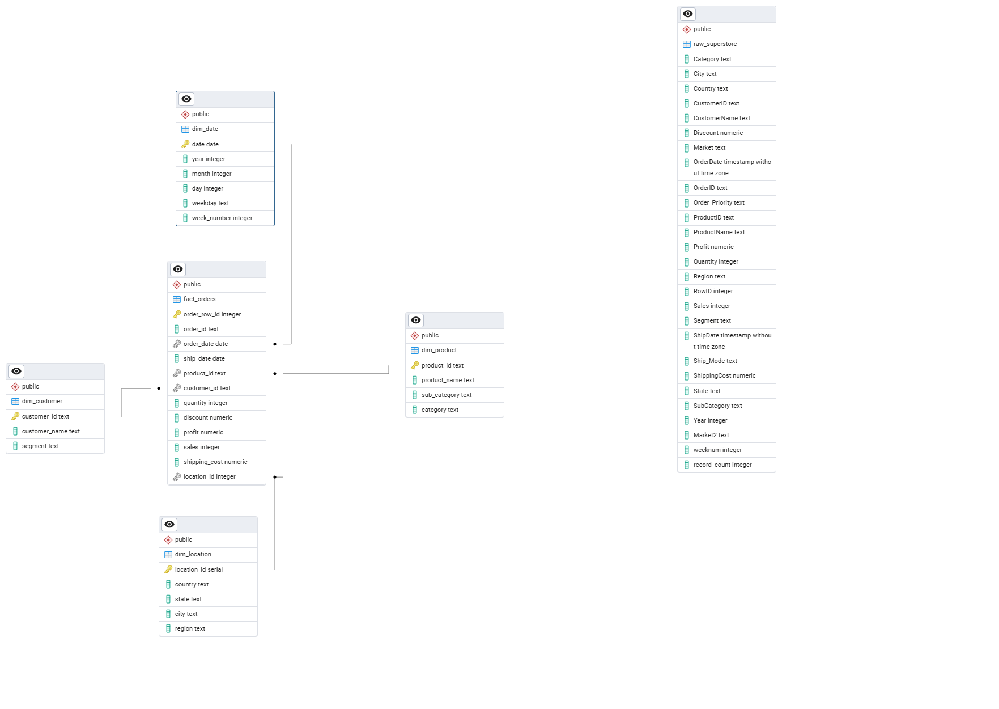
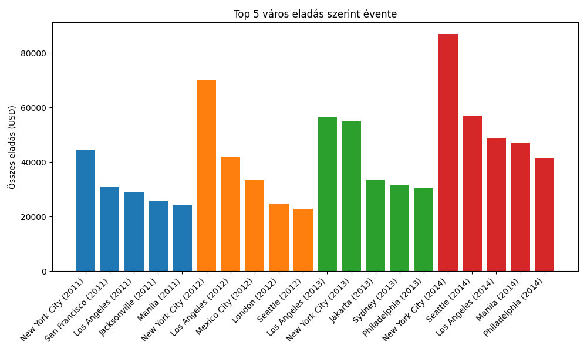

# Superstore Star Schema projektem leírása

Ez a projekt a Kaggle-n találtható Global Superstore dataset StarChema szerinti modellezését valósította meg PostgreSQL-ben, amihe PGADmin4-et és Pythont használtam (pandas + SQLAlchemy).

## Hogyan is néz ki a mappa struktúra?

- 'data/' - Bemeneti csv, a nyers fájl
- 'scripts/'- betöltöttem Postgresbe, pandas, os, dotenv és sqlalchemy segítségével. Kicsit mókolni kellett az oszlopneveket, mert a . elválasztás zavaró lehet lekérdezéseknél
- 'sql/' - fact és dim táblák létrehozása, star schema kialakítása

## Adatbázis táblák
- 'raw_superstore' - nyers adat
- 'fact_orders' - központi tábla
- 'dim_product' - egyedi product kódok alapján az összes termék, névvel, kategóriával és alkategóriával
- 'dim_customer' - egyedi customerek leírása, nevük és customer_id-juk
- 'dim_date' - minden egyes OrderDate, valamint különválasztva az év, hónap, nap, nap neve, és az év hanyadik hete
- 'dim_location' - minden egyes country-city-state-region kombináció, egyedi location_id-vel létrehozva

## Használt csomagok

Lásd : 'requirements.txt'

## Elindítás

1. Hozd létre az '.env' fájlt
2. Futtasd: 'python scipts/load_raw_data.py'

## A projekt célja

A projectet azon célból hoztam létre, hogy bemutassam az alábbi tudásomat:
1. Dataset betöltése, új adatbázisba való importálása saját megoldás szerint
2. Star schema kialakítása, hogy a jövőben megfelelő elemzéseket lehessen végrehajtani vele

## Star Schema

Az alábbi ábra bemutatja az általam létrehozott táblák schemaját, függőségekkel együtt

Pár projekt leírás amiben elemzéseket csináltam

## TOP 5 város szerinti eladás évente

## TOP profit kategóriánként, éves lebontásban

Egy egyszerű lekérdezéssel megnéztem, hogy a vizsgált 4 évben mely kategória hozta a legnagyobb profitot, nem meglepő módon mind a 4 évben a Technológia volt a nyerő, évről évre növekedő profittal.

## TOP profit szegmensenként, évre és országokra/régiókra lebontva.

Egy minimálisan bonyolultabb elemzésben megvizsgáltam, hogy a vizsgált 4 évben melyik országban melyik szegmens hozta a legnagyobb profitot. Az elemzés megmutatja, hogy a vizsgált 4 évben relatíve sokszor deficit a legjobb eredmény.
Miért is lehet ez?

Egyes ország–év kombinációkban minden szegmens veszteséges volt (negatív profit).
A lekérdezés ezek közül a legkevésbé veszteséges szegmenst választja ki.

